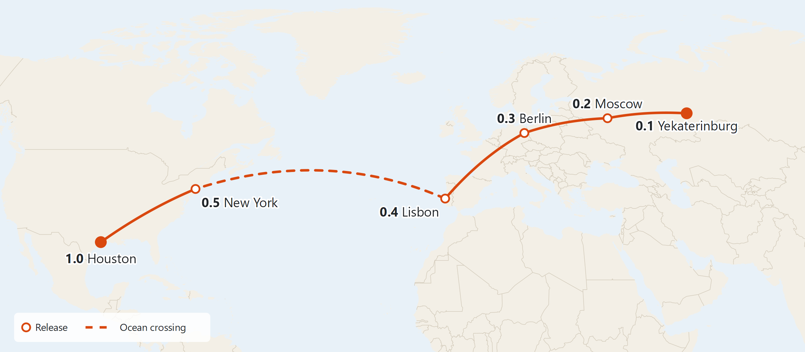

# Overview

HAWK-EYE Phoenix is a web-based application built on the experience of the current HAWK-EYE desktop software. Like the phoenix, HAWK-EYE is reborn in a new form, ready to fly higher: it keeps the proven functionality of HAWK-EYE and moves it to a modern, widely used technology stack.

## Pros

- **Significantly improved maintainability.**
- **Higher bus factor.** A widely used programming language and technology stack: Java has been in use since 1995, and many experienced developers are available.
- **Modern user interface** built on current HTML and CSS capabilities.
- **Access from a web browser.** HAWK-EYE is available from any web browser.
- **Multi-user network application.** Several users can work with HAWK-EYE at the same time from different computers on the local network, and all of them see the same live data from the instrument.
- **Data available by URL.** Every page — a sample, a measurement, a report — has its own link that can be bookmarked or sent to a colleague, who opens exactly the same data.
- **Native multi-threading** provided by the Java platform.
- **Ready for Linux.** The application targets Windows, but the whole technology stack runs on Linux as well, so a Linux version can be added if needed.
- **One application** for instrument control and the user interface. The current software runs them as two separate processes; joining them significantly reduces internal complexity.
- **Free database without size limits.** PostgreSQL replaces Microsoft SQL Server Express, which limits a database to 10 GB.

## Cons

- Development cost.

## Technology stack

Java 25 (LTS), Spring Boot with embedded Tomcat, Thymeleaf, htmx, Bootstrap 5.3, Tom Select, Bootstrap Icons, Chart.js, Tabulator, TypeScript, Vite, PostgreSQL 18, Maven, git.

- **Java** — a widely used programming language, in active use since 1995, with a large pool of developers. We use a long-term support (LTS) release; the Java runtime is included in the installer, so nothing has to be installed separately.
- **Spring Boot** — the most widely used framework for Java applications. It runs with an embedded Tomcat web server: the whole application is a single service, and no separate web server has to be installed or configured.
- **Thymeleaf** — HTML page templates rendered on the server. The user interface is plain HTML and CSS and works in any modern web browser.
- **htmx** — updates parts of a page without reloading it, keeping the user interface fast and simple.
- **Server-Sent Events (SSE)** — a standard browser technology for pushing live instrument data from the server: every open browser window receives the same data as soon as it arrives.
- **Bootstrap 5.3, Tom Select, Bootstrap Icons** — user interface components: buttons, input fields, text areas, drop-down lists with search, dialog windows and icons, in light and dark themes.
- **Chart.js** — a widely used JavaScript charting library, used for all charts: live instrument data, acquisition curves and the zone editor.
- **Tabulator** — a JavaScript table library: the sample table scrolls endlessly and loads data on demand, with filtering and sorting done by the database, so it stays fast with tens of thousands of samples.
- **TypeScript and Vite** — custom user interface components (live charts, the sample table, the zone editor) are written in TypeScript, a typed version of JavaScript, and built and minified with Vite as part of the regular Maven build.
- **PostgreSQL 18** — a free, open-source database without database size limits; the latest stable release, available for Windows, Linux and macOS and supported until 2030.
- **Maven** — build tool.
- **git** — distributed version control system; the source code is hosted on GitHub.

## Application modules

| Module | Release |
|---|---|
| User accounts, anonymous access by default | 0.1 Yekaterinburg |
| Manual control and instrument configuration | 0.1 Yekaterinburg |
| Live instrument data | 0.1 Yekaterinburg |
| Crucible tests | 0.1 Yekaterinburg |
| Inno Setup installer | 0.1 Yekaterinburg |
| Data migration tool | 0.2 Moscow |
| Sample table: on-demand loading, filtering, sorting | 0.2 Moscow |
| Sample chart viewer: curves on/off, raw/calibrated, bottom chart | 0.2 Moscow |
| Data acquisition: single analyses | 0.3 Berlin |
| Live chart viewer | 0.3 Berlin |
| Method editor | 0.3 Berlin |
| Sequence editor and automated sequence runs | 0.3 Berlin |
| Sample data processing: calibration and calculation | 0.4 Lisbon |
| Calculation editor | 0.4 Lisbon |
| Calibration editor | 0.4 Lisbon |
| Quality control | 0.4 Lisbon |
| Sample details: sample information, quality control, method and flow data recorded during the analysis | 0.4 Lisbon |
| Database backup | 0.4 Lisbon |
| All method types: Bulk Rock, Kinetics, Manual, POPI, HAWK PAM | 0.5 New York |
| GC acquisition: special cases | 0.5 New York |
| Advanced system settings | 0.5 New York |
| Administration page | 0.5 New York |
| Reports: PDF, ODT, DOCX | 1.0 Houston |
| Import/export: samples, methods, calibrations | 1.0 Houston |
| Sample editor | 1.0 Houston |
| Zone editor on charts | 1.0 Houston |
| Chart style preferences | 1.0 Houston |
| Sample table column editor | 1.0 Houston |
| Authorization: user login | 1.0 Houston |

# Road map: from Yekaterinburg to Houston

*The journey starts at our office in Yekaterinburg, Russia, and ends at yours in Houston, Texas. Every stop on the route is a software release with its own codename. At each stop you receive a working version of HAWK-EYE Phoenix that you can see, try and comment on, and each next release builds on the previous one and takes your feedback into account.*

{width=100%}

| Version | Codename | Theme | Duration |
|---|---|---|---|
| 0.1 | Yekaterinburg | The instrument in your browser | ~14 weeks |
| 0.2 | Moscow | Your data moves in | ~13 weeks |
| 0.3 | Berlin | First analyses | ~13.5 weeks |
| 0.4 | Lisbon | Results | ~14 weeks |
| 0.5 | New York | All methods, settings in order | ~13.5 weeks |
| 1.0 | Houston | Reports and personal preferences | ~13 weeks |
| | | **Total** | **~81 weeks** |

Durations are calendar weeks for a team of one developer; the whole route takes about 19 months. Each release includes automated testing, delivery, and changes based on your feedback on the previous release.

## Quality assurance

Testing is part of every release, not a separate phase at the end. A release is ready only when all its automated tests pass, together with the tests of all previous releases. The automated tests cover:

- **Algorithms** — calibration, calculation, quality control and acquisition data processing. Results are compared with those of the current HAWK-EYE on reference data sets.
- **Create, read, update and delete operations** for every type of record: samples, methods, sequences, calibrations, settings.
- **Serialization and deserialization** — settings, methods, curves, instrument protocol messages, import/export files.
- **Data migration** — conversion of existing HAWK-EYE databases, checked on copies of real databases.
- **Backup and restore** — backups created by the application are restored and checked.
- **Instrument communication** — tested against the Sparx instrument emulator.
- **All other core functionality** that can be verified by automated tests.

To compare results with the current HAWK-EYE, we will ask you for reference data sets: samples with results calculated by the current software.

## Version 0.1 "Yekaterinburg" — The instrument in your browser (~14 weeks)

*Before a long journey, you check the vehicle, pack the essentials and take a test drive around town. We don't leave the city yet — we make sure the car is ready for the road.*

**Goal.** Prove that the new web application controls the HAWK instrument directly, without the current desktop software.

**Along the way**

- **Application framework and user accounts.** The basis of the new application. User accounts are part of the design from the start; by default everyone works as an anonymous user, without entering credentials.
- **Instrument communication layer.** A new implementation of the Sparx API — the HTTP-based protocol used to talk to the instrument controller board — with drivers for every instrument unit: oven and Watlow temperature controllers, pedestal, autoloader, gas flows and thermocouples. This is the engine every later release relies on.
- **Manual control.** Operate the instrument by hand from a web browser.
- **Live instrument data.** A screen with current readings: temperatures, gas flows and sensor status.
- **Instrument settings.** Configure the instrument from the new application; the settings are stored in the new PostgreSQL database.
- **Crucible tests.** Run crucible tests from the new application.
- **Installer.** A single executable file that installs the application on a Windows computer. PostgreSQL 18 is installed separately, following our step-by-step guide. Updates work the same way: a new installer is run over the existing installation — settings and data are kept, and the database structure is updated automatically after a backup is made.
- **Automated tests.** Test infrastructure for the whole project; tests of instrument communication against the Sparx emulator, of protocol message serialization and of instrument settings storage.

**What's in this release.** Install the application yourself and operate the instrument on the Sparx instrument emulator: manual control, live data, instrument settings and crucible tests. Testing on a real instrument is planned for later releases.

**Not included yet.** Your existing data, samples, analyses, methods and reports.

## Version 0.2 "Moscow" — Your data moves in (~13 weeks)

*The first leg is the longest one on land — about 1,800 km of road. Before setting off, we move all the luggage into a new, larger trailer with no weight limit, and pack it so that everything is easy to find. At the first big city we unpack and check that nothing was lost on the way.*

**Goal.** Move your existing HAWK-EYE data to the new database and let you browse it in a web browser.

**Along the way**

- **New database structure.** Settings and dictionaries currently stored as packed data become regular database tables, and calibration data storage is simplified and made consistent.
- **Data migration tool.** A standalone tool, run by the operator, that transfers an existing HAWK-EYE database into the new structure, so all accumulated samples, methods and calibrations come along.
- **Sample table.** Browse all samples in the database, with filtering and sorting. The table loads data on demand, so it stays fast even with very large databases.
- **Sample chart viewer.** View the acquisition curves of any recorded sample: switch individual curves on and off, switch between raw and calibrated data, and use the bottom chart.
- **Automated tests.** Migration tests on copies of real databases, tests of reading and writing all migrated records and of curve data serialization.

**What's in this release.** Transfer a copy of your own database with the migration tool, then browse your samples and their curves in the new application and check that everything has arrived.

**Not included yet.** Running analyses, editing data, calculations and reports.

## Version 0.3 "Berlin" — First analyses (~13.5 weeks)

*So far the car has carried only luggage. On the way to Berlin it takes its first passengers — first one at a time, then a full bus running on a timetable.*

**Goal.** Run analyses on the instrument from the new application — from a single sample to automated sequences.

**Along the way**

- **Data acquisition.** A screen where the operator runs a complete analysis and collects data from the instrument, for the Pyrolysis family of methods: Pyrolysis, Pyrolysis S3, Pyrolysis TOC and Pyrolysis TOC/CC.
- **Live chart viewer.** Watch the curves of the sample being analysed in real time.
- **Method editor.** Create and edit analysis methods.
- **Sequence editor.** Create and edit sequences — a list of samples with their methods and autoloader positions.
- **Running sequences.** Start a sequence and let the instrument process the samples one after another with the autoloader, without operator attention.
- **Automated tests.** Complete analyses and sequence runs on the Sparx emulator; tests of creating, editing and storing methods and sequences.

**What's in this release.** Set up a method, build a sequence and run it: the instrument works through the samples automatically while the curves are displayed live.

**Not included yet.** Calibration and calculation of results, other method types, reports.

## Version 0.4 "Lisbon" — Results (~14 weeks)

*Lisbon is the westernmost point of Europe. Before crossing the ocean, the vehicle must be fully self-sufficient: everything needed for the journey has to be on board.*

**Goal.** Complete the working cycle: from collected data to calibrated, calculated and quality-checked results.

**Along the way**

- **Data processing.** Run calibration and calculation for selected samples.
- **Calculation editor.** A screen that shows the calculation procedure of each method in detail, step by step.
- **Calibration editor.** Create calibrations manually.
- **Quality control.** Automatic quality checks of the acquired data.
- **Sample details.** A detailed view of a sample: sample information, quality control results, and the method and flow data recorded during the analysis.
- **Database backup.** Create a database backup directly from the application, with a step-by-step guide for restoring from a backup.
- **Automated tests.** Calibration, calculation and quality control algorithms checked against results of the current HAWK-EYE on reference data sets; creating a backup and restoring from it.

**What's in this release.** The full analytical workflow for the Pyrolysis family of methods: run the analyses, process the results and check their quality. This is the release to compare results with the current HAWK-EYE on your own data.

**Not included yet.** Other method types, system settings, reports.

## Version 0.5 "New York" — All methods, settings in order (~13.5 weeks)

*On a ship every kilogram counts. Before boarding, we unpack the luggage, leave behind what is no longer needed and repack the rest neatly. And everyone who travels with us gets on board.*

**Goal.** Support every HAWK method type and bring the system settings in order.

**Along the way**

- **Other method types.** Data acquisition and processing for Bulk Rock, Kinetics, Manual, the POPI family and the HAWK PAM family.
- **GC acquisition.** Special cases of acquisition analysis.
- **Advanced system settings.** Settings sections are reorganised; unused settings are removed and the remaining ones get clear, consistent names.
- **Administration page.** Reworked system administration page with an updated design.
- **Automated tests.** Acquisition and processing of every method type, checked against results of the current HAWK-EYE; migration of the existing settings to the new structure.

**What's in this release.** Work with every method type in the new application, with a clean and easy-to-understand set of settings.

**Not included yet.** Reports, import/export, personal preferences.

## Version 1.0 "Houston" — Reports and personal preferences (~13 weeks)

*We have arrived at your door. Now it's time to unpack and arrange everything to your taste.*

**Goal.** Deliver the final pieces of the daily workflow and let every user tailor the application to their own way of working.

**Along the way**

- **Reports.** Reports are reviewed together with you: the required ones are kept and simplified, unnecessary ones are removed. Reports can be saved as PDF, ODT or DOCX; no office suite needs to be installed.
- **Import/export.** Exchange samples, methods and calibrations between installations.
- **Sample editor.** Edit the data of a selected sample.
- **Zone editor.** Adjust zone boundaries on the chart by dragging them.
- **Chart style preferences.** Users set up the colours, lines and other display options of the charts.
- **Sample table columns.** Users choose which columns the sample table shows and in what order.
- **User login.** Login can be turned on in the settings: users then enter their credentials to access the application. By default anonymous access stays on.
- **Automated tests.** Report generation in every format, export followed by import with the data checked to be identical, editing samples, storing user preferences and user login.

**What's in this release.** The final version of HAWK-EYE Phoenix, adjusted to the needs of each user.

## After arrival: support

*We stay around to help you settle in.*

- Development of new features.
- Bug fixes.
